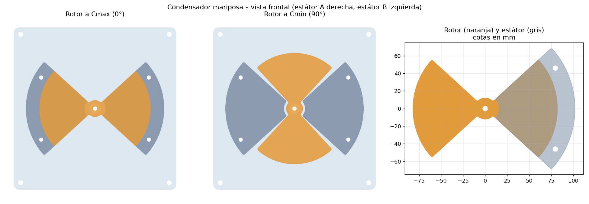
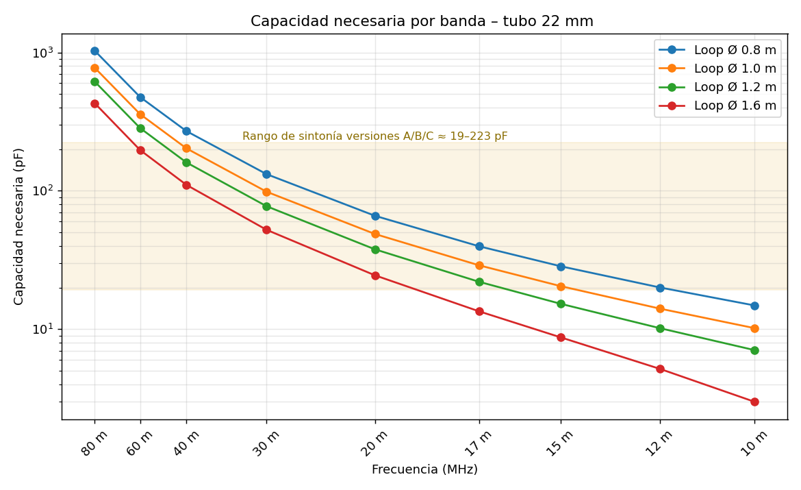
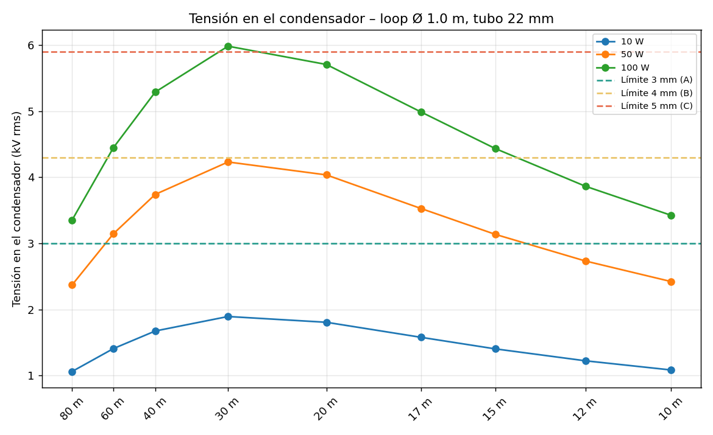
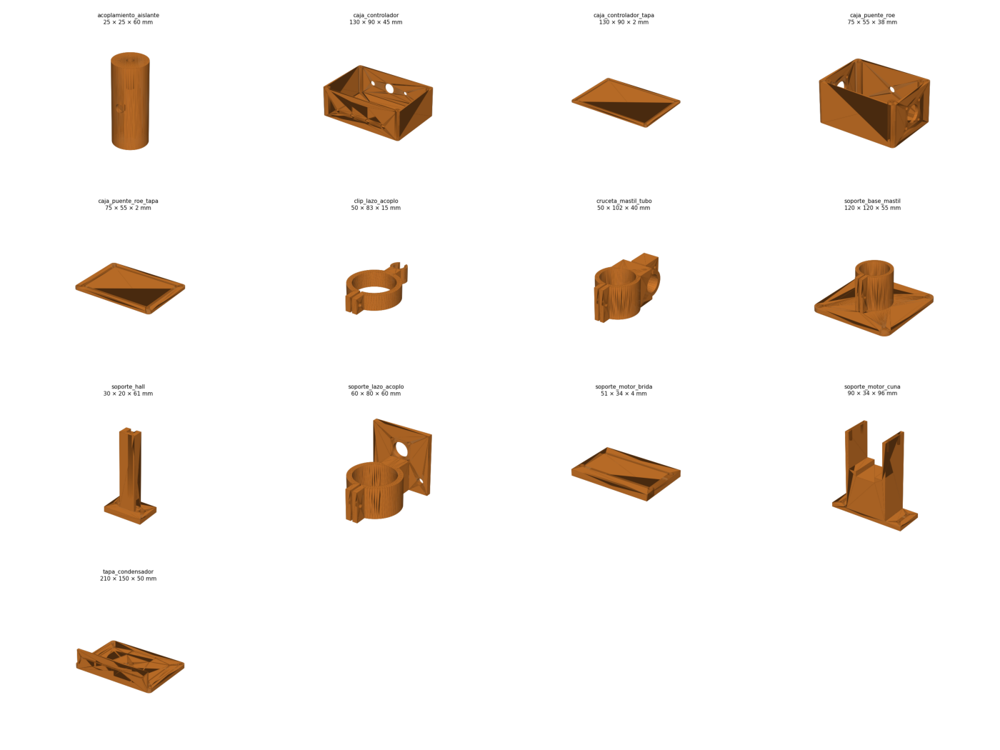

# Loop magnética con condensador mariposa motorizado y autoajuste (DIY)

Cálculo completo, planos de corte láser (DXF/SVG), **piezas imprimibles en 3D (STL + OpenSCAD)**,
**firmware de autoajuste para ESP32** y guía de construcción de un **condensador variable de aire
tipo mariposa (butterfly)** para antenas **loop magnéticas de HF**, con la lista de materiales y
**dónde conseguirlos en Murcia**.

> 👉 **Empieza por la [guía paso a paso](docs/guia_paso_a_paso.md).**


Basado en el artículo de **TA2WK** –
[High-Voltage DIY Air Capacitor for Magnetic Loop Antennas](https://www.ta2wk.com/high-voltage-diy-air-capacitor-for-magnetic-loop-antennas/)
– y en la serie de vídeos de referencia
([YouTube](https://www.youtube.com/watch?v=iPEKQIZHf5k&list=PLLFrLgZ4YFd04bd3ThvmXpGTpUq9JYBLg&index=1)).




## Resumen del diseño

| | |
|---|---|
| Tipo | Mariposa (2 estátores en serie + rotor flotante, sin contactos deslizantes) |
| Placas | Aluminio 1 mm, corte láser. Lóbulo de 85°, R rotor 82 mm, estátor R16–R102 mm |
| Área de solape por lóbulo | 4 798 mm² |
| Recorrido | 90° de Cmax a Cmin |
| Estructura | Varillas M5 inox + separadores de tuerca/arandela, tapas de policarbonato 240×240 mm |
| Loop de referencia | **Ø 1,0 m, tubo de cobre 22 mm** (octógono con codos de 45°) · 40 m → 15/17 m |

### Tres versiones (loop Ø 1 m, tubo 22 mm)

| Versión | Hueco | Separador | Juegos (estátor/lado) | Placas rotor / estátor | Cmax ≈ | Cmin ≈ | V práctica | Potencia máx. (40 / 30 / 20 m) | Paquete |
|---|---|---|---|---|---|---|---|---|---|
| **A · QRP/portable** | 3 mm | 7 mm | 16 | 15 / 32 | 212 pF | 19 pF | 3,0 kV | 32 / 25 / 28 W | 106 mm |
| **B · 50 W** ⭐ | 4 mm | 9 mm | 22 | 21 / 44 | 223 pF | 20 pF | 4,3 kV | 66 / 52 / 57 W | 190 mm |
| **C · 100 W** | 5 mm | 11 mm | 27 | 26 / 54 | 221 pF | 20 pF | 5,9 kV | 124 / 97 / 107 W | 287 mm |

Detalle banda a banda: [`resultados/variantes.md`](resultados/variantes.md).
⭐ La versión B es el mejor compromiso tamaño/potencia para un equipo de 100 W usado a 50 W en digitales o 100 W en SSB con prudencia.

### El loop de Ø 1 m (22 mm) a 100 W

| Banda | C necesaria | Eficiencia | Ancho de banda | Tensión en el condensador |
|---|---|---|---|---|
| 40 m | 203 pF | 14 % (−8,5 dB) | 5,5 kHz | 5,3 kV rms |
| 30 m | 98 pF | 37 % (−4,3 dB) | 8,8 kHz | 6,0 kV rms |
| 20 m | 49 pF | 66 % (−1,8 dB) | 19 kHz | 5,7 kV rms |
| 17 m | 29 pF | 82 % (−0,8 dB) | 41 kHz | 5,0 kV rms |
| 15 m | 20 pF | 89 % (−0,5 dB) | 70 kHz | 4,4 kV rms |

Tablas completas para loops de 0,8 / 1,0 / 1,2 / 1,6 m en [`resultados/`](resultados/).




### Comprobación con el artículo de TA2WK (hueco 3 mm)

| Juegos | Este modelo | TA2WK |
|---|---|---|
| 5 | 57 pF | 58 pF |
| 10 | 127 pF | 131 pF |
| 15 | 198 pF | 204 pF |
| 20 | 269 pF | 277 pF |
| 30 | 411 pF | 423 pF |

## Autoajuste motorizado

| | |
|---|---|
| Motor | NEMA17 + reductora planetaria 27:1 + TMC2209 a 1/16 → **240 pasos/grado** (0,17 kHz/paso en 40 m) |
| Referencia | Sensor Hall A3144 + imán en el acoplamiento aislante (home = Cmin) |
| Medida | Puente de ROE tipo Bruene (FT50-43) → ADC del ESP32 |
| Control | ESP32: 4 pulsadores, OLED, WiFi con página web, puerto serie, memoria por banda |
| Algoritmo | Barrido grueso → fino → paso a paso, aproximación siempre en el mismo sentido (anula la holgura) |


### Piezas impresas en 3D



Tapas del condensador, acoplamiento aislante, cuna del motor, soporte del Hall, unión con el mástil,
cruceta del loop, soporte y clip del lazo de acoplo, y cajas del controlador y del puente de ROE.
Detalle y ajustes de impresión: [`cad/3d/PIEZAS.md`](cad/3d/PIEZAS.md).

## Estructura del repositorio

```
calc/modelo.py             Modelo físico (condensador + loop)
calc/calcular_todo.py      Tablas y gráficas en resultados/
cad/generar_planos.py      DXF de corte láser, SVG y vista previa en cad/salida/
cad/generar_3d.py          parametros.scad → STL + PNG (cad/3d/) + posiciones del motor + firmware/bandas.h
cad/generar_esquemas.py    Esquemas de conjunto y cableado (docs/img/)
cad/3d/scad/               Fuentes OpenSCAD paramétricos
cad/3d/stl/                STL listos para imprimir
firmware/autotune_loop/    Firmware ESP32 (Arduino)
firmware/test/             Simulación del autoajuste en el PC
resultados/                Tablas .md/.csv, lista de materiales, posiciones del motor, gráficas
docs/guia_paso_a_paso.md   ⭐ Guía completa de construcción con todos los datos
docs/montaje.md            Montaje detallado del condensador
docs/formulas.md           Fórmulas explicadas
docs/materiales_murcia.md  Dónde comprar cada cosa en Murcia
```

## Cómo recalcular para tu loop

```bash
pip install -r requirements.txt          # y OpenSCAD instalado para los STL
python calc/calcular_todo.py --diametro 1.2 --tubo 22 --potencia 100
python cad/generar_planos.py
python cad/generar_3d.py --version B --diametro 1.2
python cad/generar_esquemas.py
sh firmware/test/simular.sh              # opcional: prueba del autoajuste
```

Para cambiar la geometría de las placas edita `GeometriaPlacas` en `calc/modelo.py`
y vuelve a ejecutar ambos scripts (los DXF se regeneran solos).

## Materiales (resumen)

Placas de aluminio 1 mm por corte láser · 2 tapas impresas en PETG/ASA (o policarbonato por láser) ·
varilla roscada M5 inox + tuercas DIN 934 + arandelas DIN 125 inox · 2 rodamientos 625ZZ ·
acoplamiento aislante impreso · NEMA17 con reductora 27:1 + TMC2209 + ESP32 · tubo de cobre 22 mm + 8 codos de 45° ·
pletina de cobre · coaxial y conector.
Cantidades exactas: [`resultados/lista_materiales.md`](resultados/lista_materiales.md) ·
Tiendas y talleres en Murcia: [`docs/materiales_murcia.md`](docs/materiales_murcia.md).

## Limitaciones y avisos

- **Cmin es una estimación** (7 % de Cmax + 3 pF). Mídela con un LCR: si sale más alta, 15/12/10 m no
  sintonizarán con el loop de 1 m; quita placas o usa un loop menor para esas bandas.
- Las tensiones suponen un loop perfectamente adaptado y sin pérdidas extra en el condensador:
  son el **peor caso** (bueno para dimensionar).
- La tensión práctica sigue el criterio de TA2WK (≈1–1,2 kV/mm). Humedad, polvo y rebabas la reducen.
- **Peligro: alta tensión RF (varios kV).** Lee la sección de seguridad de [`docs/montaje.md`](docs/montaje.md).

## Publicar / clonar

```bash
git clone https://github.com/TU_USUARIO/condensador-mariposa-loop.git
```

Para publicar tu copia: crea un repositorio vacío en GitHub y ejecuta `sh publicar.sh URL` (o `publicar.bat URL` en Windows).

## Créditos y licencia

- Diseño original y tabla de referencia: TA2WK. Modelo de cálculo, planos y documentación: este repositorio.
- Código bajo licencia MIT; documentación y planos bajo CC BY-SA 4.0. Ver [`LICENSE`](LICENSE).

73!
