# Piezas imprimibles

Parámetros comunes: capa 0,2 mm, boquilla 0,4, 4–5 perímetros. **Exterior: ASA o PETG** (el PLA se deforma al sol de Murcia).

| Pieza | Cant. | Material / ajustes | Vista |
|---|---|---|---|
| [`tapa_condensador.stl`](stl/tapa_condensador.stl) | 2 | PETG/ASA · 5 perímetros · 40 % gyroid · cara interior en la cama | 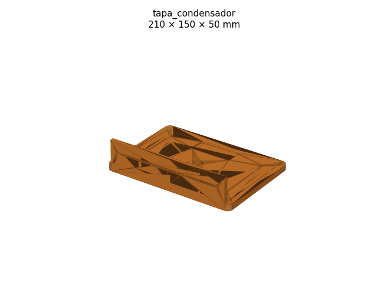 |
| [`acoplamiento_aislante.stl`](stl/acoplamiento_aislante.stl) | 1 | PETG · 100 % relleno · de pie | 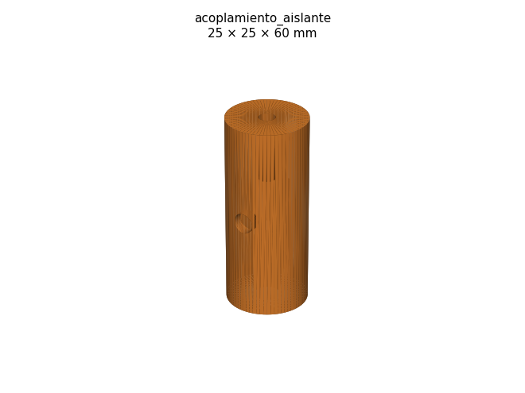 |
| [`soporte_motor_cuna.stl`](stl/soporte_motor_cuna.stl) | 1 | PETG · 30 % · sobre el pie | 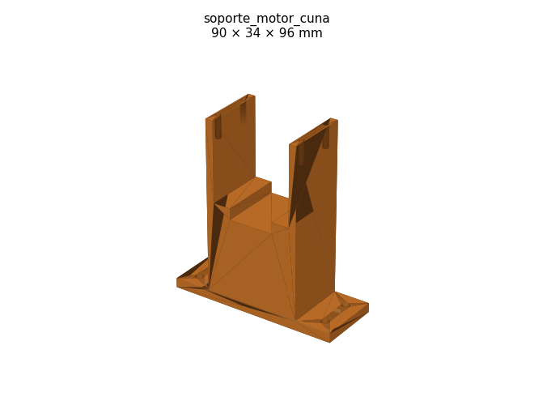 |
| [`soporte_motor_brida.stl`](stl/soporte_motor_brida.stl) | 1 | PETG · 40 % | 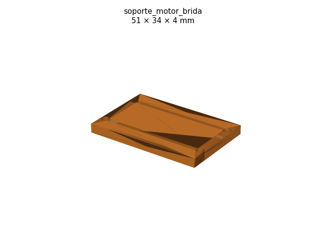 |
| [`soporte_hall.stl`](stl/soporte_hall.stl) | 1 | PETG · 40 % | 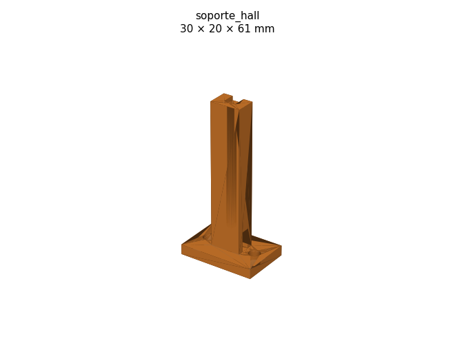 |
| [`soporte_base_mastil.stl`](stl/soporte_base_mastil.stl) | 1 | ASA/PETG · 50 % · placa en la cama | 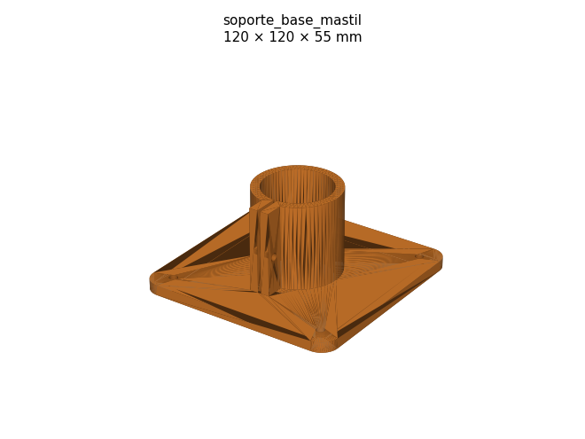 |
| [`cruceta_mastil_tubo.stl`](stl/cruceta_mastil_tubo.stl) | 1 | ASA/PETG · 50 % · soportes en el agujero del tubo | 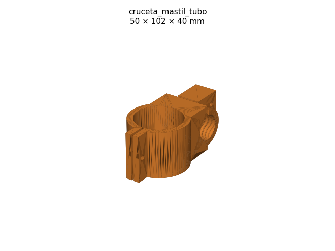 |
| [`soporte_lazo_acoplo.stl`](stl/soporte_lazo_acoplo.stl) | 1 | ASA/PETG · 50 % | 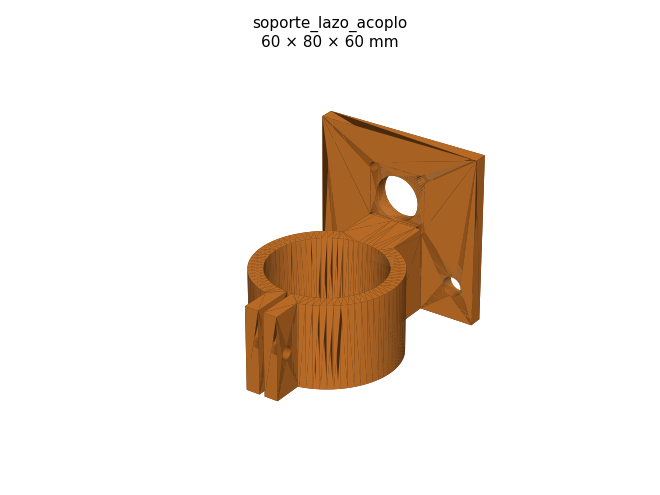 |
| [`clip_lazo_acoplo.stl`](stl/clip_lazo_acoplo.stl) | 1 | ASA/PETG · 40 % (ajusta d_cable) | 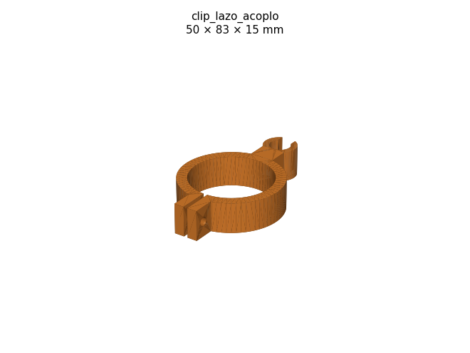 |
| [`caja_controlador.stl`](stl/caja_controlador.stl) | 1 | PLA/PETG · 20 % | 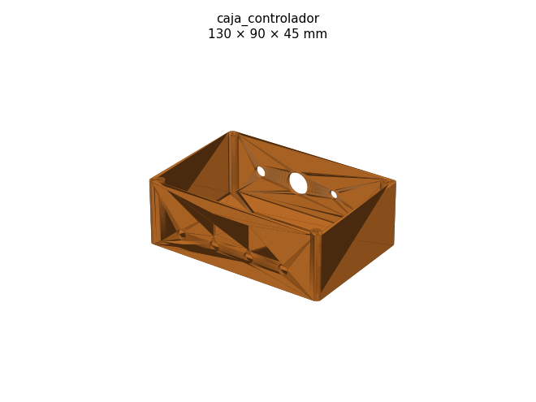 |
| [`caja_controlador_tapa.stl`](stl/caja_controlador_tapa.stl) | 1 | PLA/PETG · 20 % | 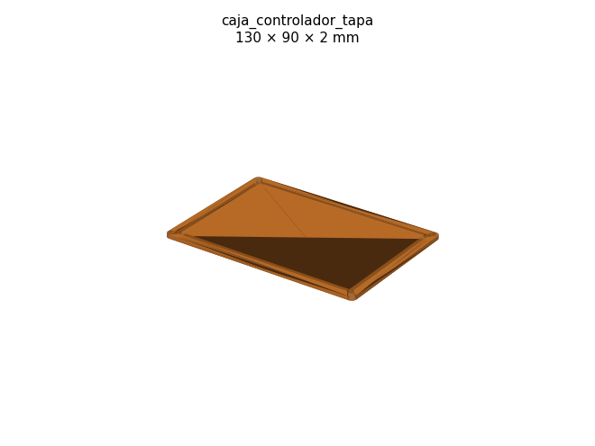 |
| [`caja_puente_roe.stl`](stl/caja_puente_roe.stl) | 1 | PLA/PETG · 20 % | 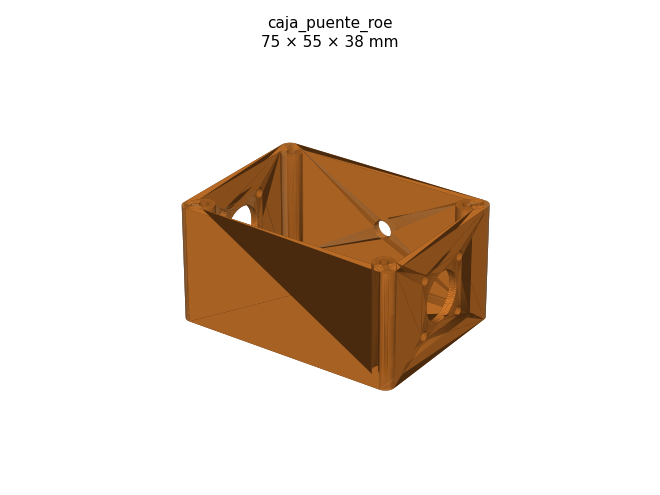 |
| [`caja_puente_roe_tapa.stl`](stl/caja_puente_roe_tapa.stl) | 1 | PLA/PETG · 20 % | 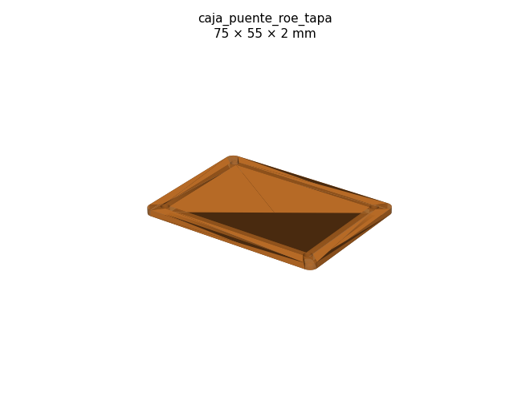 |
