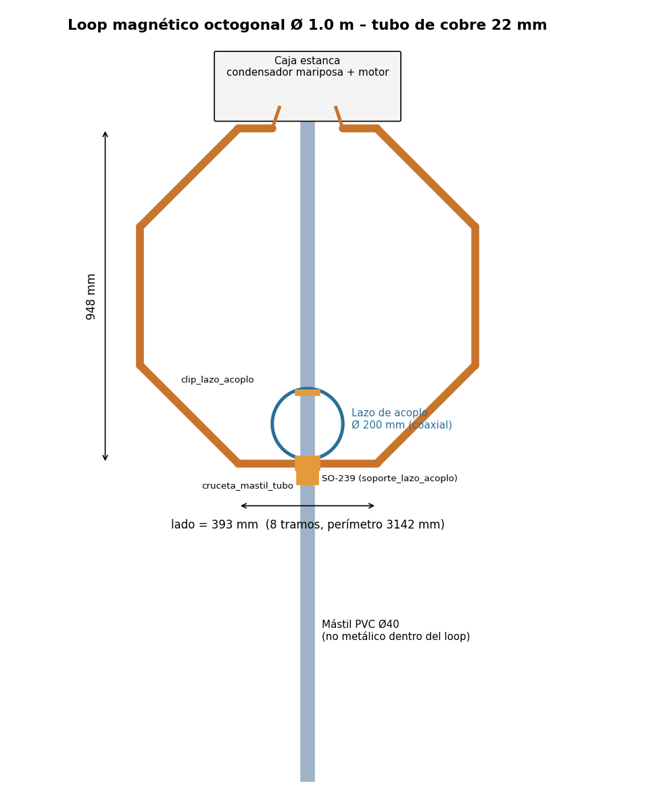
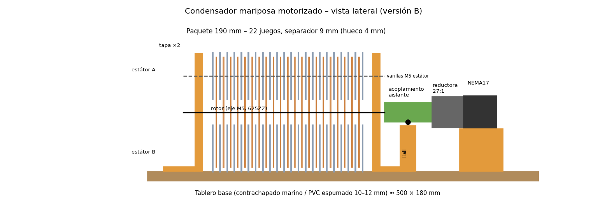
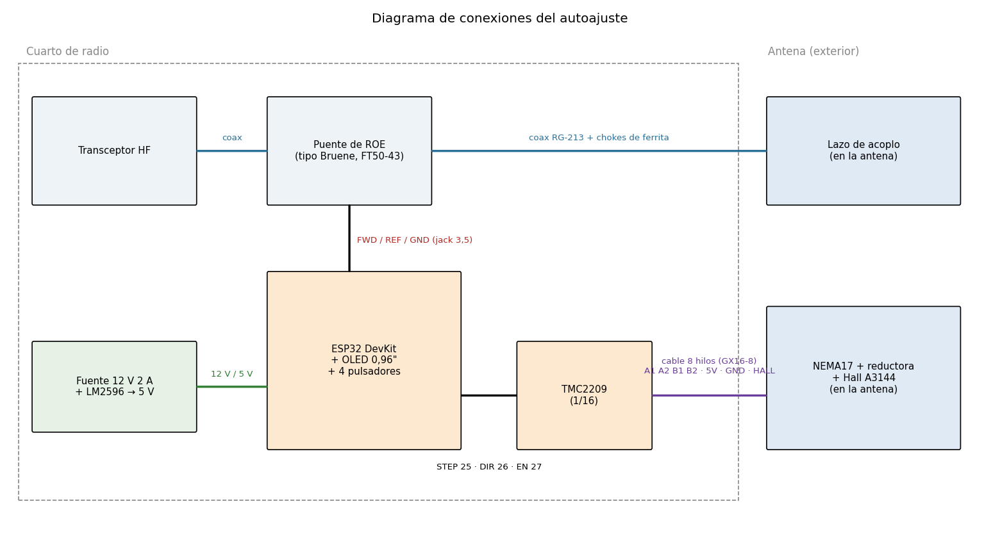

# Guía paso a paso: loop magnética con condensador mariposa motorizado y autoajuste

Esta guía reúne **todos los datos calculados** en el repositorio y explica, en orden, cómo
construir una antena loop magnética de HF de **Ø 1 m** con un **condensador mariposa de aire**
movido por un **motor paso a paso** y un **controlador ESP32 que se ajusta solo** (busca la ROE
mínima). Las piezas de plástico se imprimen en 3D y las placas metálicas se cortan por láser.



---

## 0. Qué vas a construir: datos clave

| Parte | Valor |
|---|---|
| Loop | Octógono de **Ø 1,0 m** (948 mm entre lados), tubo de **cobre de 22 mm**, perímetro 3 142 mm, lado 393 mm |
| Bandas | **40, 30, 20, 17 y 15 m** (12 y 10 m solo si la Cmin real sale por debajo de 14 pF) |
| Condensador | Mariposa **versión B**: 22 juegos, hueco 4 mm, separador 9 mm, **≈ 20–223 pF**, **4,3 kV rms** |
| Potencia máxima | ≈ **50 W** continuos (FT8/RTTY); 66 W en 40 m, 94 W en 15 m (ver tabla §13) |
| Motor | NEMA17 + reductora planetaria **27:1**, driver TMC2209 a 1/16 → **240 pasos por grado** |
| Resolución | 0,17 kHz/paso en 40 m; 1,4 kHz/paso en 20 m (el ancho de banda es 5,5 y 19 kHz) |
| Control | ESP32 + puente de ROE + OLED + 4 pulsadores + página web por WiFi |
| Referencia | Sensor Hall A3144 + imán en el acoplamiento (home = Cmin) |



> ¿Quieres otra potencia o tamaño? Ejecuta `python calc/calcular_todo.py --diametro X --potencia Y`
> y `python cad/generar_3d.py --version A|B|C`: se regeneran tablas, STL y `bandas.h`.

---

## 1. Lista de compra completa

Precios orientativos (2026). Dónde comprar en Murcia: [`materiales_murcia.md`](materiales_murcia.md).

### 1.1 Condensador (versión B)

| Material | Cantidad | Dónde | € aprox. |
|---|---|---|---|
| Placas de aluminio 1 mm cortadas por láser: `rotor.dxf` | 21 + 3 de repuesto | Taller de corte láser (Murcia/Molina) | 30–50 |
| Placas de aluminio 1 mm: `estator.dxf` | 44 + 4 de repuesto | Íd. | 50–80 |
| Varilla roscada M5 inox A2, 1 m | 2 (salen 4 × 280 mm + eje 350 mm) | Obramat / ferretería industrial | 8 |
| Tuercas M5 DIN 934 inox | caja de 200 + 50 | Íd. | 10 |
| Arandelas M5 DIN 125 inox | caja de 200 | Íd. | 5 |
| Rodamientos 625ZZ (5×16×5) | 2 | Tienda de impresión 3D / online | 3 |
| Collarines de 5 mm (o doble tuerca M5) | 2 | Online | 3 |
| Varilla roscada M6 de nylon + 8 tuercas nylon (tirantes) | 4 × 260 mm | Online / suministro industrial | 8 |
| Pletina o malla de cobre 20–25 mm | 1 m | Electrónica Llorga / chatarrería de cobre | 8 |
| Tornillos pasamuros de latón M6 × 40 + tuercas y arandelas | 2 | Ferretería | 3 |
| Terminales de ojal de cobre 16 mm² M6 | 4 | Material eléctrico | 3 |

### 1.2 Motorización y caja de la antena

| Material | Cantidad | Dónde | € aprox. |
|---|---|---|---|
| Motor NEMA17 con reductora planetaria 27:1 (salida Ø 8 mm) | 1 | Online (StepperOnline, AliExpress, Amazon) | 30–40 |
| Sensor Hall A3144 + imán de neodimio 6×3 mm | 1 + 2 | Electrónica Llorga / online | 3 |
| Tornillos prisioneros M3 × 6 + tuercas M3 | 2 + 2 | Ferretería | 1 |
| Tablero base contrachapado marino o PVC espumado 10–12 mm | 500 × 180 mm | Obramat / Leroy Merlin (corte a medida) | 8 |
| Tornillos M4 inox (o nylon junto al rotor) | 16 | Ferretería | 3 |
| Caja estanca o caja de plástico grande (tapa hacia abajo) ≥ 520 × 200 × 200 mm | 1 | Obramat / Leroy Merlin | 15–30 |
| Conector aviación GX16-8 (macho + hembra) | 2 juegos | Electrónica Llorga / online | 6 |
| Cable de 8 hilos (alarma, 0,22 mm²; ≥ 0,5 mm² si pasa de 15 m) | lo que mida la bajada | Material eléctrico | 1/m |
| Ferritas de clip mezcla 31 (para el cable de control y el coaxial) | 6 | Online / tiendas de radio | 10 |

### 1.3 Loop, mástil y acoplo

| Material | Cantidad | Dónde | € aprox. |
|---|---|---|---|
| Tubo de cobre rígido 22 mm, barra de 2,5 m | 2 | Obramat / BigMat / fontanería | 40–60 |
| Codos de cobre 45° para soldar, 22 mm | 8 | Íd. | 10 |
| Soldadura de plata (varilla 15–40 % Ag) + desoxidante, o estaño-plata de fontanería | 1 | Íd. | 10–25 |
| Tubo de PVC de presión Ø 40 mm (mástil) | 2 m | Fontanería | 6 |
| Conector SO-239 de brida cuadrada | 1 | Electrónica Llorga | 3 |
| Coaxial RG-213 (lazo de acoplo, 0,65 m) + bajada | 0,7 m + bajada | Íd. | 3/m |
| Bridas UV negras | 1 bolsa | Ferretería | 3 |

### 1.4 Controlador (cuarto de radio)

| Material | Cantidad | € aprox. |
|---|---|---|
| ESP32 DevKit v1 (38 pines) | 1 | 8 |
| Driver TMC2209 (BigTreeTech o similar) + disipador | 1 | 6 |
| Pantalla OLED 0,96" SSD1306 I2C | 1 | 4 |
| Pulsadores de panel de 7 mm | 4 | 3 |
| Fuente 12 V 2 A + convertidor LM2596 (ajustado a 5 V) | 1 + 1 | 12 |
| Condensador electrolítico 100 µF 35 V (junto al TMC2209) | 1 | 0,5 |
| Placa perforada 5 × 7 cm, tiras de pines hembra, jack DC de panel 5,5/2,1 | 1 | 4 |
| Resistencias 10 kΩ ×5, 1 kΩ ×2, 100 Ω 1 W ×2 | — | 1 |
| Zener 3,3 V (BZX55C3V3) ×2, condensadores 100 nF ×4, 10 nF ×2 | — | 1 |
| **Puente de ROE**: toroide FT50-43, hilo esmaltado 0,4–0,5 mm (1 m), 2 diodos 1N5711 (o BAT41), trimmer cerámico 5–30 pF, condensador 330 pF 500 V NP0/mica, 2 SO-239, jack 3,5 mm estéreo | 1 juego | 12 |

Los toroides FT50-43 y los diodos 1N5711 no suelen estar en tiendas físicas: tiendas online
de radioafición o AliExpress, o pregunta en el **Radio Club Región de Murcia (EA5RCZ)**.

### 1.5 Filamento

≈ **1 kg de PETG o ASA** (las dos tapas del condensador se llevan unos 500 g) + 150 g de PLA
para las cajas del cuarto de radio. **No uses PLA en el exterior**: se deforma al sol de Murcia.

---

## 2. Herramientas

Impresora 3D (cama ≥ 220 × 220 mm), calibre, soldador de 40–60 W, soplete (gas MAPP o propano),
cortatubos, lima y lija 400–600, taladro, llaves de 8 y 10 mm, multímetro, **NanoVNA o analizador
de antena**, **carga fantasma de 50 Ω** y, a ser posible, medidor LCR (medidor de capacidad).

---

## 3. Fase 1 — Imprimir las piezas 3D

Los ficheros listos están en [`cad/3d/stl/`](../cad/3d/stl) y los fuentes paramétricos (OpenSCAD) en
[`cad/3d/scad/`](../cad/3d/scad). Vista de todas las piezas: [`cad/3d/PIEZAS.md`](../cad/3d/PIEZAS.md).

| Pieza | Cant. | Material | Relleno | Orientación / notas |
|---|---|---|---|---|
| `tapa_condensador` | **2** | PETG/ASA | 40 % gyroid, 5 perímetros | Cara lisa en la cama; el pie queda hacia arriba (sin soportes). 8–15 h c/u |
| `acoplamiento_aislante` | 1 | PETG | **100 %** | De pie. Es el aislante del rotor: sin huecos |
| `soporte_motor_cuna` | 1 | PETG | 30 % | Sobre el pie |
| `soporte_motor_brida` | 1 | PETG | 40 % | Plana |
| `soporte_hall` | 1 | PETG | 40 % | De pie |
| `soporte_base_mastil` | 1 | ASA/PETG | 50 % | Placa en la cama, collar hacia arriba |
| `cruceta_mastil_tubo` | 1 | ASA/PETG | 50 % | Soportes solo en el agujero del tubo |
| `soporte_lazo_acoplo` | 1 | ASA/PETG | 50 % | Collar en la cama |
| `clip_lazo_acoplo` | 1 | ASA/PETG | 40 % | Ajusta `d_cable` en el .scad si no usas RG-213 |
| `caja_controlador` + `_tapa` | 1 + 1 | PLA/PETG | 20 % | Abierta hacia arriba |
| `caja_puente_roe` + `_tapa` | 1 + 1 | PLA/PETG | 20 % | Abierta hacia arriba |

Ajustes generales: capa 0,2 mm, boquilla 0,4 mm, 4–5 perímetros, sin ventilador (ASA) o 30 % (PETG).

**Después de imprimir:**

1. Prueba los rodamientos 625ZZ en las tapas: deben entrar a presión suave (si no, lija o imprime con un 0,5 % más de escala XY).
2. Pasa una broca de 5,5 mm por los agujeros de las varillas y una de 6,5 mm por los de los tirantes.
3. Mete una tuerca M3 en cada ranura del acoplamiento y rosca los prisioneros.
4. Pega el imán de 6×3 mm en su alojamiento del acoplamiento con cianoacrilato.
5. Para cambiar medidas (mástil de Ø 32, tubo de 18 mm…), edita `PARAM` en `cad/generar_3d.py` y ejecútalo: se regeneran todos los STL.

---

## 4. Fase 2 — Cortar las placas por láser

1. Lleva a un taller (lista en [`materiales_murcia.md`](materiales_murcia.md)) los ficheros
   [`cad/salida/rotor.dxf`](../cad/salida/rotor.dxf) y [`cad/salida/estator.dxf`](../cad/salida/estator.dxf).
2. Pide **aluminio de 1 mm**, **24 rotores y 48 estátores** (con repuestos), **desbarbados** y **sin doblar**.
3. Al recogerlos: comprueba que todas las placas son planas, lija los cantos (400 → 600) y límpialas con alcohol isopropílico.

Geometría: lóbulo de 85°, R rotor 82 mm, estátor de R16 a R102 mm, varillas M5 a R92 mm ±30°,
área de solape por lóbulo 4 798 mm².

---

## 5. Fase 3 — Montar el condensador

Procedimiento detallado en [`montaje.md`](montaje.md). Resumen con las piezas impresas:

1. **Varillas de los estátores**: corta 4 tramos de M5 de **280 mm**. Pásalos por la tapa trasera (2 a cada lado) con tuerca y arandela por fuera y por dentro.
2. Deja **12 mm** entre la cara interior de la tapa y la primera placa de estátor (2 tuercas + 4 arandelas).
3. Apila en cada lado **22 placas de estátor** separadas por **9 mm** (2 tuercas + 1 arandela). Comprueba con el calibre cada 5 placas.
4. **Rotor**: en el eje M5 de **350 mm** monta las **21 placas de rotor** separadas también por 9 mm, con los lóbulos alineados. Bloquéalas con collarín o doble tuerca en cada extremo.
5. Mete los rodamientos 625ZZ en ambas tapas, introduce el rotor girado 90° (posición Cmin), coloca la tapa delantera y cierra con los **4 tirantes de nylon M6**.
6. **Centra el rotor**: a Cmax cada placa de rotor debe quedar a **4,0 mm** de sus dos estátores vecinos. Ajusta con las tuercas del eje hasta que gire 360° sin rozar.
7. **Pruebas**: sin continuidad entre A, B y el rotor. Con el LCR anota **Cmin** (rotor a 90°) y **Cmax** (0°). Esperado: ≈ 20 / 223 pF.

---

## 6. Fase 4 — Motorización

1. Atornilla las dos tapas (por sus pies) al **tablero base** de 500 × 180 mm, con el eje paralelo al lado largo.
2. Sujeta el motor en la **cuna** con la **brida** (4 tornillos M3 de rosca-chapa). El eje de la reductora queda a **75 mm** de la base, la misma altura que el eje del condensador.
3. Une los ejes con el **acoplamiento aislante** (lado de Ø 8 mm al motor, de Ø 5 mm al rotor). Deja **≥ 5 mm** de hueco entre la tapa y el acoplamiento.
4. **Alinea**: gira a mano la salida de la reductora; el condensador no debe cabecear. Si lo hace, calza la cuna.
5. Atornilla el **soporte del Hall** bajo el acoplamiento: la cara del A3144 debe quedar a **1,5 mm** del plástico. Gira el rotor a **Cmin** y coloca el imán justo encima del sensor en esa posición.
6. Pasa el cable de 8 hilos por un prensaestopas de la caja y ponle el conector GX16-8.

| Hilo GX16-8 | Señal |
|---|---|
| 1, 2 | Bobina A del motor (A1, A2) |
| 3, 4 | Bobina B del motor (B1, B2) |
| 5 | +5 V (alimentación del A3144, patilla 1) |
| 6 | GND (A3144 patilla 2) |
| 7 | HALL (A3144 patilla 3, salida) |
| 8 | Reserva / malla |

Identifica las bobinas del motor con el multímetro: los dos hilos con continuidad entre sí forman una bobina.

---

## 7. Fase 5 — El loop de cobre


1. **Medidas**: octógono de lado **393 mm** entre centros de codo. Mide en tus codos la distancia *z* del centro del codo al fondo del casquillo (suele ser 8–12 mm). **Longitud de corte = 393 − 2·z** (con z = 10 → **373 mm**).
2. **Corta 7 tramos** de 373 mm (los 6 lados inclinados/verticales y el de abajo) y **2 tramos cortos** para el lado superior: cada uno de (393 − 200)/2 − z ≈ **86 mm**. Así queda un hueco de **200 mm** arriba para el mástil y el condensador.
3. Aplana 20 mm del extremo libre de cada tramo corto (tornillo de banco) y taládralo a 6,5 mm.
4. **Suelda** los 8 codos con soldadura fuerte de plata (o estaño-plata bien caliente). Limpia y aplica desoxidante: **cada soldadura mala son miliohmios de pérdida**, y con 100 W hay 25–50 A circulando.
5. Comprueba sobre el suelo que el octógono es plano.
6. Monta el **mástil de PVC Ø 40** atravesando el loop: la **cruceta** sujeta el lado de abajo y la **caja del condensador** va arriba, sobre el `soporte_base_mastil`.
7. Pasa los tornillos **pasamuros de latón M6** por las paredes de la caja; por fuera se atornillan los extremos aplanados del loop y por dentro la pletina de cobre hasta las varillas de los estátores A y B. **Conexiones lo más cortas y anchas posible.**

---

## 8. Fase 6 — Lazo de acoplo (Faraday)

1. Corta **0,65 m de RG-213** (lazo de **Ø 200 mm = D/5**).
2. En el punto **opuesto al conector** (arriba) quita 10 mm de malla: el vivo sigue entero y la malla queda cortada.
3. En el conector: el **vivo de un extremo va al centro** del SO-239 y la malla de ese extremo a masa. En el **otro extremo** suelda **vivo y malla juntos a masa**.
4. Monta el SO-239 en el `soporte_lazo_acoplo`, justo encima de la cruceta, y sujeta la parte alta del lazo con el `clip_lazo_acoplo`.
5. El lazo debe quedar **en el plano del loop** y tocando (sin contacto eléctrico) el lado inferior.

---

## 9. Fase 7 — Electrónica



### 9.1 Controlador (ESP32)

| ESP32 | Conecta a |
|---|---|
| GPIO 25 | TMC2209 STEP |
| GPIO 26 | TMC2209 DIR |
| GPIO 27 | TMC2209 EN |
| GPIO 23 | HALL (con **10 kΩ a 3,3 V** y 100 nF a GND) |
| GPIO 32 / 33 / 18 / 19 | Pulsadores ARRIBA / ABAJO / TUNE / BANDA (el otro lado a GND) |
| GPIO 36 (VP) | FWD del puente (a través de 1 kΩ; zener 3,3 V a GND) |
| GPIO 39 (VN) | REF del puente (a través de 1 kΩ; zener 3,3 V a GND) |
| GPIO 21 / 22 | OLED SDA / SCL |
| 5V / GND | Salida del LM2596 ajustada a **5,0 V** |

**TMC2209**: VM = 12 V (con el electrolítico de 100 µF lo más cerca posible), VIO = 3,3 V,
**MS1 y MS2 a 3,3 V (1/16)**, salidas A1-A2-B1-B2 al GX16-8. Ajusta la **Vref ≈ 0,9–1,0 V
(≈ 0,7 A)** con el potenciómetro antes de conectar el motor.

### 9.2 Puente de ROE (tipo Bruene)

Se monta en su caja entre el transceptor y la bajada de coaxial. Es un transformador de
corriente más un divisor capacitivo:

```
 SO-239 TX ●────────┬───────────( T1 )───────────● SO-239 ANT
                    │     el vivo pasa por el centro de T1 = 1 espira
                   C1  trimmer 5–30 pF
                    │
                    ├──────────── toma central del secundario de T1
                    │
                   C2  330 pF
                    │
                   GND

 Secundario de T1: 20 espiras en FT50-43, toma central en la espira 10,
 100 Ω entre los extremos A y B.

   extremo A ──|>|── 1N5711 ──┬──── 10 kΩ ──┬──── 1 kΩ ──┬── FWD (GPIO 36)
                             10 nF         10 kΩ          zener 3,3 V
                              │             │             │
                             GND           GND           GND

   extremo B ──|>|── 1N5711 ── (mismo circuito) ────────── REF (GPIO 39)
```

Cálculo: en cada extremo aparece `Vc ± I·R/(2N)`. Con N = 20, R = 100 Ω y una carga de 50 Ω,
`I·R/(2N) = V/20`; si el divisor da `Vc = V/20` (C1 ≈ 17 pF con C2 = 330 pF), un extremo
vale V/10 (directa) y el otro 0 (reflejada).

- **T1**: toroide FT50-43 con **20 espiras** de hilo esmaltado de 0,5 mm y **toma central** (en la espira 10). Entre los dos extremos, **100 Ω** (2 × 51 Ω o 2 × 47 Ω en serie; 1 W).
- La **toma central** va al punto medio del divisor **C1 (trimmer 5–30 pF) / C2 (330 pF)**, que toma tensión de la línea.
- Con 50 Ω en la salida, un extremo da la tensión directa (≈ V/10) y el otro se anula: ese es **REF**.
- Con 10 W, FWD ≈ 1,5 V en el ADC; admite hasta ~30 W sin saturar. Las zener de 3,3 V protegen el ESP32 cuando emites a 100 W.

**Calibración**: pon la **carga fantasma** en ANT, emite 5–10 W y gira **C1 hasta que REF sea
mínimo** (≈ 0 V). Si el mínimo sale en el otro extremo, intercambia los cables FWD/REF.

---

## 10. Fase 8 — Firmware

1. Instala el **Arduino IDE 2**, añade el gestor de placas `https://espressif.github.io/arduino-esp32/package_esp32_index.json` e instala **esp32 (Espressif)**.
2. Instala las librerías **Adafruit SSD1306** y **Adafruit GFX** (Gestor de librerías).
3. Abre [`firmware/autotune_loop/autotune_loop.ino`](../firmware/autotune_loop/autotune_loop.ino). Placa: **ESP32 Dev Module**.
4. Revisa [`config.h`](../firmware/autotune_loop/config.h): pines, contraseña de la WiFi (`73loop73`) y umbrales.
5. [`bandas.h`](../firmware/autotune_loop/bandas.h) contiene las posiciones calculadas; se regenera con `python cad/generar_3d.py`.
6. Compila y sube. En el monitor serie (115200) verás `Loop Tuner listo`.

Sin hardware, puedes probar la lógica del autoajuste en el PC con [`firmware/test/simular.sh`](../firmware/test/simular.sh):
compila el firmware con g++ y simula una resonancia con 300 pasos de holgura en la reductora.

---

## 11. Fase 9 — Pruebas y puesta a punto

1. **Sin RF, motor en la mesa**: al arrancar el ESP32 busca el home. Si gira al revés (se aleja del imán), pon `INVERTIR_DIR 1`.
2. **Holgura**: mueve ±1000 pasos y observa el rotor; si la holgura de tu reductora supera 1,5° (360 pasos), sube `HOLGURA` en `config.h`.
3. **Con el analizador** en el lazo de acoplo (antena ya montada, mejor a su altura definitiva):
   - Selecciona 40 m. El motor va al preset (19 554 pasos). Retoca con ARRIBA/ABAJO hasta ver la resonancia en el NanoVNA y pulsa *Guardar* en la web (o `g` por serie).
   - Ajusta la **forma del lazo de acoplo** (más redondo/ovalado, más cerca o lejos del tubo) hasta conseguir ROE < 1,5.
   - Repite en 30, 20, 17 y 15 m.
4. **Primer autoajuste con RF**: conecta el puente, pon el equipo en **5 W de portadora** (FM/AM/CW o TUNE) y pulsa TUNE. Tarda 2–15 s. Al terminar, el motor se desconecta (sin ruido ni consumo) y la posición queda guardada.
5. Sube la potencia poco a poco escuchando si chisporrotea: **nunca por encima de la potencia máxima de la tabla §13**.

---

## 12. Uso diario

| Acción | Botón | Web / serie |
|---|---|---|
| Cambiar de banda (va a la posición aprendida) | BANDA | desplegable / `b<n>`, `n` |
| Autoajuste (con portadora de 5–10 W) | TUNE (corto) | AUTO TUNE / `t` |
| Retoque fino | ARRIBA / ABAJO (mantener = continuo) | « » / `u`, `d` (×10: `U`, `D`) |
| Guardar la posición actual para la banda | — | Guardar / `g` |
| Buscar home | TUNE mantenido 2 s | Home / `h` |
| Ir a una posición concreta | — | `p<pasos>` |

Web: conéctate a la WiFi **LoopTuner** (clave `73loop73`) y abre **http://192.168.4.1** desde el móvil.

Dentro de una banda: con el ancho de banda de la loop (5,5 kHz en 40 m) hay que reajustar
cada vez que te muevas más de 2–3 kHz. En 40 m cada paso mueve 0,17 kHz; en 20 m, 1,4 kHz.

---

## 13. Tabla de datos (loop Ø 1 m, tubo 22 mm, condensador versión B)

| Banda | C necesaria | Ángulo desde Cmin | Paso preset | kHz/paso | Ancho de banda | Eficiencia | Tensión a 50 W | Potencia máx. |
|---|---|---|---|---|---|---|---|---|
| 40 m | 203 pF | 81,5° | 19 554 | 0,17 | 5,5 kHz | 14 % (−8,5 dB) | 3,7 kV | 66 W |
| 30 m | 98 pF | 37,8° | 9 064 | 0,50 | 8,8 kHz | 37 % (−4,3 dB) | 4,2 kV | 52 W |
| 20 m | 49 pF | 16,9° | 4 061 | 1,37 | 19 kHz | 66 % (−1,8 dB) | 4,0 kV | 57 W |
| 17 m | 29 pF | 8,6° | 2 068 | 2,86 | 41 kHz | 82 % (−0,8 dB) | 3,5 kV | 74 W |
| 15 m | 20 pF | 5,1° | 1 214 | 4,57 | 70 kHz | 89 % (−0,5 dB) | 3,1 kV | 94 W |

Tablas completas: [`resultados/loop_1m.md`](../resultados/loop_1m.md),
[`resultados/variantes.md`](../resultados/variantes.md), [`resultados/posiciones_motor.md`](../resultados/posiciones_motor.md).

---

## 14. Problemas frecuentes

| Síntoma | Causa probable / solución |
|---|---|
| "ERROR: sin home" | Imán lejos del sensor (> 3 mm), sensor sin 5 V, falta el pull-up de 10 kΩ |
| "Sin portadora" | No estás emitiendo, potencia < 3 W o FWD/REF cruzados |
| No encuentra la ROE mínima en una banda | Cmin real demasiado alta (15 m) → quita 2–3 placas de rotor; o fuera de rango en 40 m → añade placas |
| ROE mínima 2–3 | Ajusta el lazo de acoplo (forma y distancia), no el condensador |
| El ajuste se desplaza con el tiempo | Holgura: sube `HOLGURA`; prisioneros flojos en el acoplamiento |
| Chasquidos/arcos al transmitir | Rebabas, polvo o humedad; baja potencia; limpia y seca la caja |
| Ruido en recepción | El driver queda activo: comprueba EN (GPIO 27); ferritas en el cable de 8 hilos |
| La resonancia cambia con la lluvia | Normal en loops: reajusta (para eso está el autoajuste) |

---

## 15. Seguridad

- **Alta tensión de RF**: 3–6 kV en el condensador y en los extremos del loop. Nunca toques la antena transmitiendo.
- **Exposición**: campo magnético intenso cerca del loop. A 50–100 W mantén **≥ 3 m** de personas; consulta los límites del RD 1066/2001.
- Transmite los primeros minutos a baja potencia y comprueba la temperatura de las uniones.
- La caja del condensador debe ser **estanca y con desagüe** (un agujero pequeño abajo) para que no se condense agua.
- Protege el mástil y la bajada contra rayos; desconecta la antena cuando haya tormenta.

73 y buena construcción.
